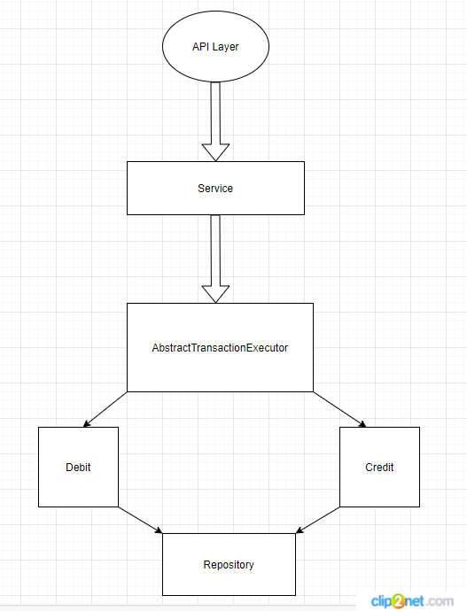

# Payments API for money send
Simple API for sending money between accounts.

# Tech problem 
There are a lot of frameworks and tools for creating service-oriented and microservice architectures.
On the other side if we're working with high-load environment, 
we need to use fast tech approaches for handling big amount of queries.
For this purpose we can't use Spring and Hibernate/JPA, because those 2 not a light weight frameworks.
 
# Tech Stack
- Java 8
- Micronaut (IoC/DI based on Netty)
- Command design pattern for transactions
- JUnit
- Mock for database

# Architecture

#Performance
https://piotrminkowski.com/2019/04/09/performance-comparison-between-spring-boot-and-micronaut

# Alternatives
### Fraweworks
- Quarkus (totally new.  i'm trying to avoid using new technologies for fintech) 
- Akka Http (powerfull, but requires knowledge of functional programming)
### Libs
- graphQL could be a great solution for api and dto approach replacement. But i tried to use classic method. 

## How to run

#### Requirements
- JDK 8 or newer

#### Running
- Download the source code
- In root folder, execute `mvn clean install && cd target && java -jar payments.jar`. You can build project with included `.mvnw` bash
- Other way - with help docker `mvn clean install && docker build . -t payments:1.0 && docker run payments:1.0`
- Run: `curl http://localhost:8888/api`
